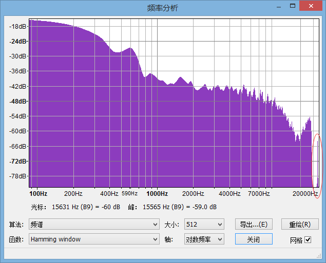
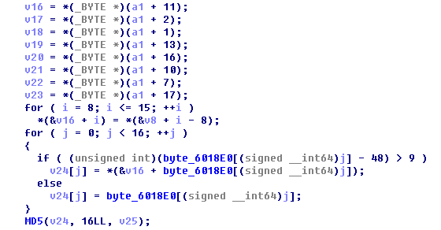
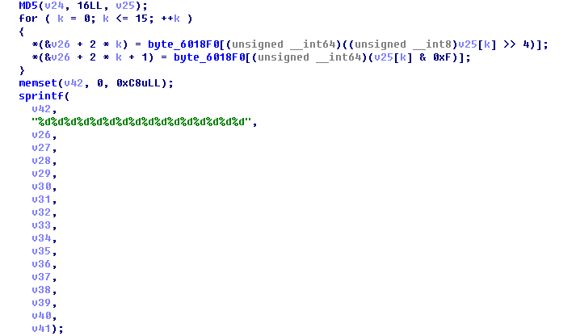

# 2015强网杯Writeup

## Ringtone
用audacity打开ringtone.wav，查看频率分析，如图

切换到spectrogram模式，如图，

可看到高频区域有一些信息，
翻译成二进制得0b01100110、0b00110110，
也即是f6字符，猜测应该是flag{...}，
多看几个字符后发现每8位结尾都是0，
于是把每8bit倒序一下，得flag
flag{f0r3ns1c_1s_r3al1y_v3ry_ve7y_fun}
吐槽一下flag太长了..人肉读二进制ascii真蛋疼= =

## keygen
ida打开，发现0x400b56是关键部分，

发现是把v16~v23部分与一些常数结合后md5，然后

把MD5字符串这些转成对应字符的ascii码整数字符串，去掉0，

再选第5位后字符与v8~v15比较。
然后发现要提交10个不同的sn才过。

然后写keygen，随便乱生成v16~v23部分，加上常数部分后md5一下，计算出对应的v8~v15后填进sn的对应位，加上-就可以了，
最后几位sn是废的，直接填1111

下面的代码有些细节也许不对，偶尔生成的sn有问题，但懒得看了，反正换了几个字符串来生成sn就过了
keygen.cpp
[code]

#include "md5.h"
#include <iostream>

using namespace std;

void calc(const char *st) {
	MD5 a(st);
	const byte *p = a.digest();
	string v42 = "", res="";
	char buff[10];
	for(int k=0; k<=15; k++) {
		sprintf(buff, "%x", p[k]>>4);
		sprintf(buff, "%d", buff[0]);
		if(buff[0]!='0')
			v42+=buff;
		sprintf(buff, "%x", p[k]&0xf);
		sprintf(buff, "%d", buff[0]);
		if(buff[0]!='0')
			v42+=buff;
	}
	int pp=0, k=5;
	while(pp<8) {
		while(v42[pp+k]=='0') k++;
		res+=v42[pp+k];
		pp++;
	}
	printf("%c%c%c%c-%c%c%c%c-%c%c%c%c-%c%c%c%c-1111\n",
		res[3],
		st[0],
		st[8],
		res[7],
		res[6],
		res[4],
		st[4],
		res[5],
		st[2],
		st[6],
		res[1],
		st[10],
		res[0],
		st[12],
		st[14],
		res[2]);
}

int main() {
	calc("1413191117121012");
	calc("2413191117121012");
	calc("3413191117121012");
	calc("4413191117121012");
	calc("5413191117121012");
	calc("7413191117121012");
	calc("8413191117121012");
	calc("1413191117121022");
	calc("1413191117121032");
	calc("1413191117121002");
	return 0;
}
[/code]

得到的sn:
5115-6415-1111-8111-1111
4215-1815-1191-2117-1111
4314-7815-1191-1117-1111
4419-9819-1111-9112-1111
9519-8719-1111-9112-1111
5711-2415-1191-1117-1111
5818-4515-1191-9118-1111
5119-9215-1151-7121-1111
1118-4112-1151-8137-1111
8115-5111-1181-4104-1111